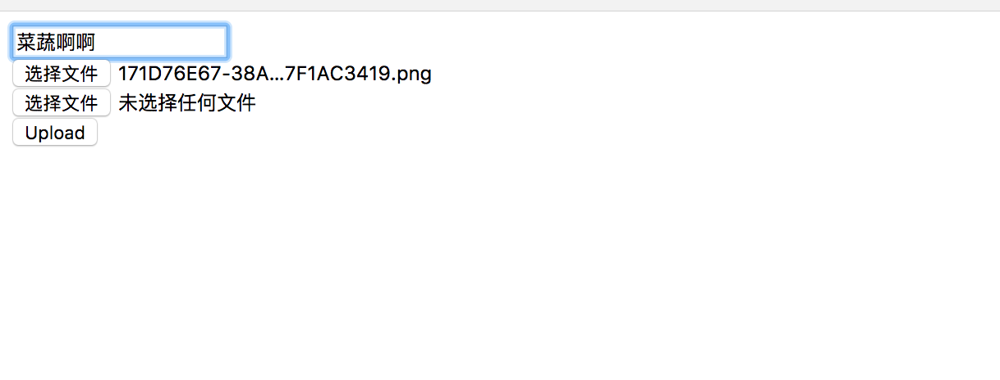
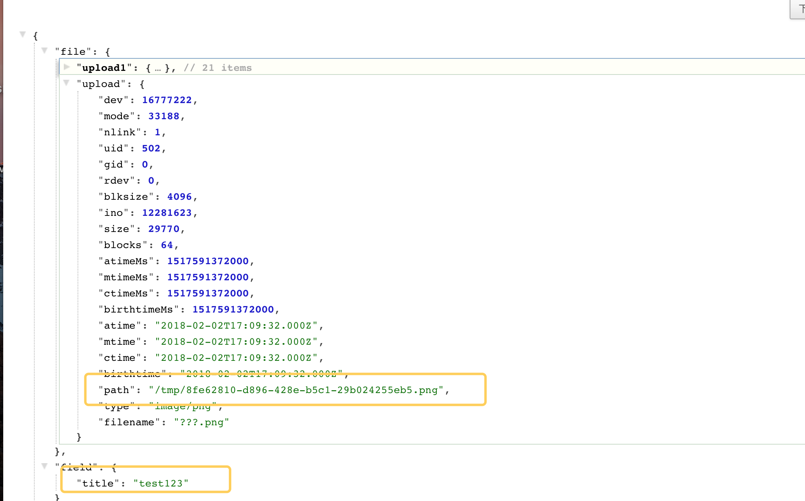
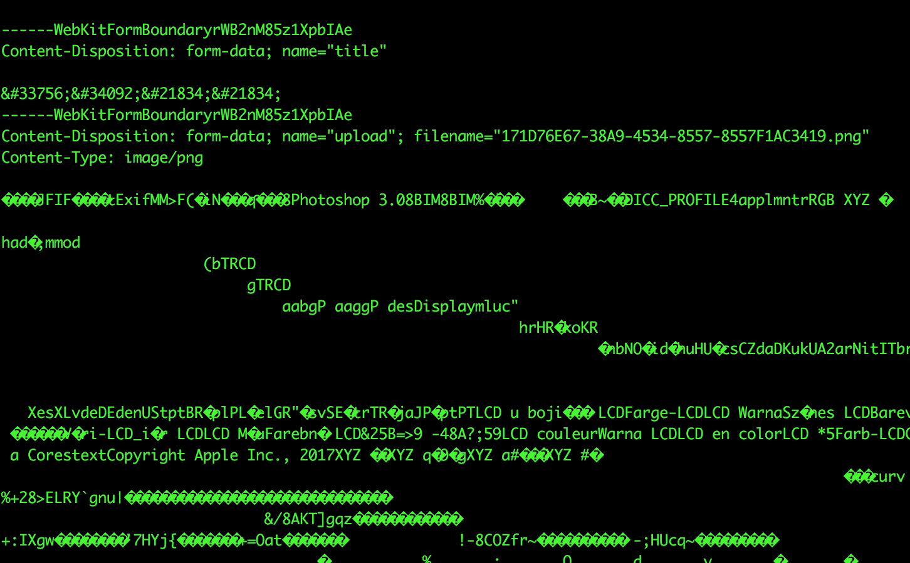
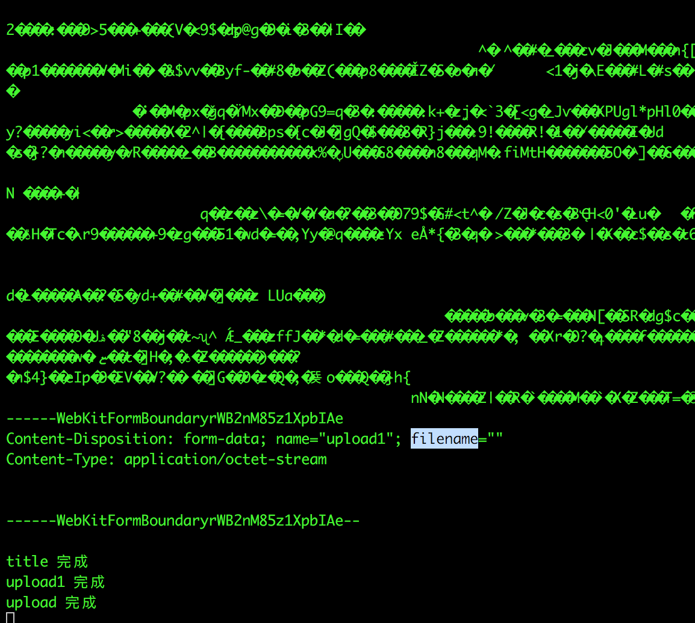

# 实现一个简单的fromidable

## 脚本
```sh
npm run start
访问 localhost:3333
```

## 单元测试
```sh
npm run test

➜  easy-formidable npm run test

> easy-formidable@1.0.0 test /Users/jimmytu/wbb/demo/node/easy-formidable
> mocha ./test


  测试上传
name 完成
image 完成
jsFile 完成
    ✓ 测试上传后的文件长度是否和原来的一样 (42ms)


  1 passing (48ms)
```


## Example

Parse an incoming file upload.
```javascript
const http = require('http');
const Formidable = require('./formidable');

const server = http.createServer((req, res) => {
  if (req.url == '/upload' && req.method.toLowerCase() == 'post') {
    const formidable = new Formidable();
    formidable.parse(req, (err, file, field) => {
      if (err) {
        res.end(JSON.stringify(err));
        return;
      }
      res.setHeader('content-type', 'application/json');
      res.end(JSON.stringify({ file, field }));
    });
    formidable.on('fileComplete', (name) => {
      console.log(name, '完成');
    });
    formidable.on('fieldComplete', (name) => {
      console.log(name, '完成');
    })
    return;
  }
  res.writeHead(200, {'content-type': 'text/html'});
  res.end(
    '<form action="/upload" enctype="multipart/form-data" method="post">'+
    '<input type="text" name="title"><br>'+
    '<input type="file" name="upload" multiple="multiple"><br>'+
    '<input type="file" name="upload1" multiple="multiple"><br>'+
    '<input type="submit" value="Upload">'+
    '</form>'
  );
});

module.exports = server;
```

## 例子效果
###上传

###返回json


## 其他
```javascript
  class Formidable extends EventEmitter {
    ....
  }
```
Formidable继承EventEmitter，可以进行一些事件的触发
 例如:
```javascript
  formidable.on('fileComplete', (name) => {
    console.log(name, '完成');
  });
  formidable.on('fieldComplete', (name) => {
    console.log(name, '完成');
  })
```
 每一个文件或者字段被解析完成会触发相应的事件


## 产生的原因
由于网上很多教人怎么使用 node-fromidable来进行文件上传的文章，但是却很少去解释为什么node-fromidable能够上传文件的文件，所以自己进行了一下相应的研究，
首先是一个http form-data的请求过来以后，需要先获得相应的body内容，但是不能使用字符串的拼接（不清楚请看一下深入浅出Nodejs的Buffer那一章节），所以使用buffer来进行拼接
```javascript
const body = [];
const handleData = (chunk) => {
  body.push(chunk);
};
req.on('data', handleData);
req.on('end', handleEnd);
```

这样我们就拿到了body

body进行toString()以后是如下图所示




然后进行body的解析

根据网上这个文件的参考结果来看
http://blog.csdn.net/bugall/article/details/44873651

大致是以下几个步骤

首先获取boundary
```javascript
const boundary = Buffer.from(`--${req.headers['content-type'].split('=')[1]}`);
```

然后通过boundary进行内容切分
并且根据是否有filename这个字段来认为他是field还是file

大致代码如下

```javascript
const str = item.toString();
const filenameReg = /filename="(.+)"/;
...
// 获取到filename
const filenameResult = str.match(filenameReg);
if (filenameResult) {
  const filename = filenameResult[1];
  ...
  const filePath = `/tmp/${uuid()}.${extension}`;
  // 在临时目录创建一个可写流
  const ws = fs.createWriteStream(filePath);
  // 去掉文件类型后的换行和内容开始前的空号
  const sourceBuf = bsplit(item, Buffer.from('\r\n\r\n'))[1];
  // 去掉最后的换行
  const buf = sourceBuf.slice(0, sourceBuf.length - 2)
  ws.write(buf, () => {
    // 写入完成进行接下来的操作
    this.emit('fileComplete', key);
    file[key] = {
      ...fs.statSync(filePath),
      path: filePath,
      type,
      filename,
    };
    resolve();
  });
  ws.on('error', (error) => {
    reject(error);
  });
} else {
  // 这里简单的取出field
  this.emit('fieldComplete', key);
  field[key] = bsplit(item, Buffer.from('\r\n'))[3].toString();
  resolve();
}
```

注释写的比较清楚了，具体大家可以下载到本地跑一下例子。
